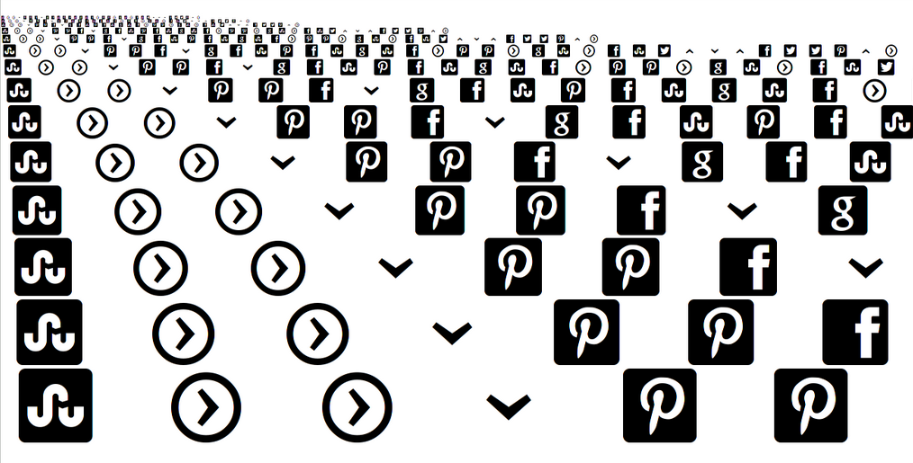
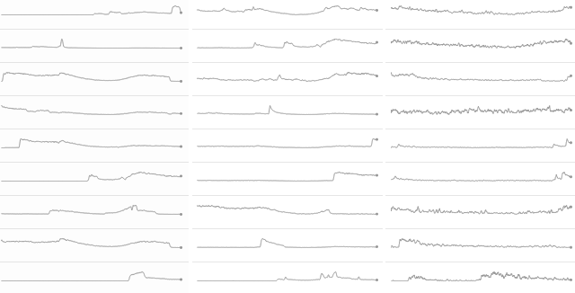

========================
Analytics for Journalism
========================

Andrew Montalenti, CTO

.. rst-class:: logo

    .. image:: ./_static/parsely.png
        :width: 40%
        :align: right

What is Parse.ly?
=================

Analytics provider for large-scale content sites.

    .. image:: ./_static/banner_01.png
        :align: center
    .. image:: ./_static/banner_02.png
        :align: center
    .. image:: ./_static/banner_03.png
        :align: center
    .. image:: ./_static/banner_04.png
        :align: center

Online content ecosystem
========================

Marginal cost of web content: **zero**.

.. rst-class:: build

* | **Print-era content**: Monopolist one-way megaphones.
  | Newspapers, TV, radio.
* | **Web-era content**: Distributed n-way channels. 
  | Media websites, blogs, social networks.
* | **Content deluge**: Commoditized the writer.
  | Enthroned the editor.
* | **Editors vs Algorithms**: Google News and Reddit.
  | Prismatic and Flipboard.

What is online journalism?
==========================

Being redefined, but not without trouble.

.. rst-class:: build

* | **Legacy definition**: "Content by professional journalists." 
  | Is BuzzFeed journalism?
* | **Romantic definition**: "Content in the public interest."
  | Is Wikipedia journalism?
* | **Market definition**: "Content worth my money." 
  | Is Hulu journalism?

My definition
=============

A blend of these definitions:

* Content that informs, inspires, or outrages me.
* Content worth my time and money.
* Content worth my shares and links.

What makes journalism "good"?
=============================

"Good journalism" is that which, it would be beneficial to society that its content were widely dissemenated.

Snowden / Greenwald / Guardian is a recent example.

A whole lot of "bad journalism" subsidizes the good stuff.

.. rst-class:: spaced

    .. image:: ./_static/old_news.png
        :width: 50%
        :align: center

Onward to the tech
==================

.. rst-class:: spaced

    .. image:: /_static/tech_stack.png
        :width: 90%
        :align: center

Why does journalism need analytics?
===================================

Websites have a variety of interesting "first-party" metrics:

* pageviews
* unique visitors
* sessions and paths
* time spent
* page engagement (scroll, copy/paste)
* referrers
* search keywords

E-commerce & ads drove web analytics industry.

Is online journalism special?
=============================

Yes.

* **Short Shelf Life**: average content shelf-life <48 hours
* **High Frequency Publishing**: 1000's posts per day
* **Unclear Conversion Goals**: nothing to buy
 
.. image:: ./_static/pulse.png
    :width: 60%
    :align: center

Content metadata is rich
========================

    =========== ===================================================
    Field        Description
    =========== ===================================================
    title        Post or page title (article headline)
    link         Canonical URL for post/page
    image_url    URL for associated image
    type         ``post, frontpage, sectionpage``
    media_type   ``article, slideshow, video``
    pub_date     Publication date
    section      Section of the site (e.g. Politics)
    author       Author who created the post
    tags         List of editorially-provided tags
    topics       List of machine-generated topics
    genres       List of machine-generated genres
    =========== ===================================================

Third-party metrics emerging
============================

* **Comments**: Disqus, LiveFyre, Wordpress
* **Shares**: Twitter, Google+, LinkedIn, Facebook
* **Pins and Saves**: Pinterest, Delicious
* **Upvotes and Likes**: Reddit, Digg
* **Queues**: Instapaper, Readability

Time series data
================

.. image:: ./_static/sparklines_stacked.png
    :align: center

Summary data
============

.. rst-class:: spaced

    .. image:: ./_static/summary_viz.png
        :align: center

Benchmark data
==============

.. rst-class:: spaced

    .. image:: ./_static/benchmarked_viz.png
        :align: center

Information radiators
=====================

.. rst-class:: spaced

    .. image:: ./_static/glimpse.png
        :width: 100%
        :align: center

Demo time
=========

Parse.ly tech stack
===================

Parse.ly is a **Python** & **Javascript** shop.

(Some Java used begrudgingly and as necessary.)

.. rst-class:: spaced

    .. image:: ./_static/monitors.jpg
        :width: 90%
        :align: center

Data centers
============

Servers running across:

* **Amazon Web Services**: data collection and archiving.
* **Rackspace Cloud**: data aggregation, web crawling, APIs.
* **Himem Colo**: live analysis, dashboard worker nodes.

Over **40 production** nodes with approximately **1 terabyte** of hot production RAM.

Scale
=====

* **5 billion pageviews per month** in May 2013
* Typical **>2,500 requests per second** daily peak
* Nearly **20 terabytes** of raw compressed data

.. rst-class:: spaced

    .. image:: ./_static/pv_growth.png
        :width: 90%
        :align: center

Stack Overview
==============

.. rst-class:: spaced

    .. image:: ./_static/oss_logos.png
        :width: 90%
        :align: center

Backend Stack, v1 (2010-2011)
=============================

    ============= =======================================
    Tool          Usage
    ============= =======================================
    nginx         data collection
    Amazon S3     raw logs for offline analysis
    MongoDB       pre-aggregated data
    feedparser    RSS/Atom feed parsing
    Celery        distributed task queue
    ============= =======================================

Backend Stack, v2 (2011-2012)
=============================

    ============= =======================================
    Tool          Usage
    ============= =======================================
    Cloud LBs\*   data collection **without SPOF**
    node.js\*     **fast, dynamic** Javascript config 
    Amazon S3     raw logs for offline analysis
    MongoDB\*     **sharded** pre-aggregated data 
    Redis\*       **real-time** data; past 24h, minutely
    Scrapy\*      **maintainable** web crawling
    Celery        distributed task queue
    ZeroMQ\*      **lightweight** service communication
    Hadoop\*      **compute-intensive** offline analysis
    Solr\*        **rich** content indexing
    ============= =======================================

Backend Stack, v3 (2012-2013)
=============================

    ============= ==========================================
    Tool          Usage
    ============= ==========================================
    Cloud LBs     data collection without SPOF
    node.js       fast, dynamic Javascript configuration
    Amazon S3     raw logs for offline analysis
    MongoDB       sharded, replicated aggregate data 
    Redis         real-time data; past 24h, minutely
    Scrapy        maintainable web crawling
    Storm\*       **elastic** distributed task queue
    Kafka\*       **fast, reliable** service communication
    hll\*         **memory-stable** estimated cardinality
    Pig\*         **readable** offline analysis scripts
    SolrCloud\*   **scalable** content indexing, trends 
    ============= ==========================================

Frontend Stack, v1 (2010-2012)
==============================

    ============= ==========================================
    Tool          Usage
    ============= ==========================================
    Django        web app framework
    jQuery        Javascript utilities
    Protoviz.js   data visualization framework
    ============= ==========================================

Frontend Stack, v2 (2012-2013)
==============================

    ============= ==========================================
    Tool          Usage
    ============= ==========================================
    Django        web app framework
    jQuery        Javascript utilities
    Bootstrap\*   **responsive** Javascript/CSS layouts
    Pandas\*      **in-memory** data manipulation
    LESS\*        **modular** CSS styling
    d3.js\*       **customizable** dataviz framework
    rq\*          **asynchronous** reporting
    Tornado\*     **high-performance**, REST/JSON API
    ============= ==========================================

Other important infrastructure
==============================

    ============= ==========================================
    Tool          Usage
    ============= ==========================================
    Graphite      internal service statistics
    Munin         system health and heartbeat metrics
    Sentry        plant-wide exception catching
    logstash      plant-wide logging
    Chef          server configuration management
    vagrant       local VM-based development
    Fabric        scriptable SSH sessions
    ============= ==========================================

2013 areas of interest
======================

* **Text mining**: Wikidata, content clustering.
* **More social data**: gevent-based API integrations.
* **Hourly storage**: MongoDB, schema redesigns.
* **Content optimization**: Solr, Function Queries.
* **Visitor analysis**: Cassandra, wide-row storage.
* **Network trends**: more work with Pig.

Crazy data ideas
================

.. rst-class:: build

* Solr for time series data?
* Cassandra > MongoDB + Redis?
* Real-time Map/Reduce?

Where are we going with this?
=============================

.. rst-class:: spaced

    .. image:: ./_static/gel_metrics.png
        :width: 90%
        :align: center

Growth
======

* New Monthly Visitors
* New Linking Domains
* New Shares

Engagement
==========

* Avg Time Spent
* Avg Posts per Visit
* Comments Per Post
* Shares Per Post

Loyalty
=======

* Monthly Repeat Visitors
* Monthly Homepage Visitors
* Visits Per Month
* Percent with Multiple Daily Visits

Using GEL for visitor targeting
===============================

   ============== ======================================
   Segment        Target with...
   ============== ======================================
   **Growth**     Ads, e-mail newsletters, follows
   **Engagement** Premium ads, sponsored content
   **Loyalty**    Subscriptions, ebooks, paid content
   ============== ======================================

Using GEL for content strategy 
==============================

   ============== ======================================
   Maturity       Invest in...
   ============== ======================================
   **Growth**     Short-form, shareable, unique
   **Engagement** Medium-form, emotional, convenient 
   **Loyalty**    Long-form, insightful, indispensible
   ============== ======================================

API Engagement Tools
====================

.. rst-class:: spaced

    .. image:: ./_static/ars_related_stories.png
        :align: center
        :width: 80%

API Loyalty Tools
=================

.. rst-class:: spaced

    .. image:: ./_static/ars_mystories.png
        :align: center

Conclusion
==========

.. rst-class:: spaced

    .. image:: ./_static/parsely.png
        :width: 90%
        :align: center

.. rst-class:: build

* Parse.ly aims to become the **definitive analytics system** for online journalism and content.
* "Big Data": it actually applies here.
* "Big Payoff": **help journalism thrive in the digital age**.

Contact Us
==========

Get in touch. We're hiring :)

* http://parse.ly
* http://twitter.com/parsely

And me:

* http://pixelmonkey.org
* http://twitter.com/amontalenti

